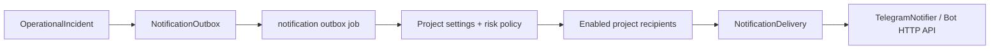

# Current notification architecture

`operational_incident_service._enqueue` creates outbox records. The scheduled
job `jobs/notification_outbox.py` calls `enqueue_due_reminders` and
`process_notification_outbox`. The worker locks eligible outbox rows with
`FOR UPDATE SKIP LOCKED`, applies policy, creates recipient-specific delivery
records with an idempotency key, and calls `TelegramNotifier.send_message`.

Additional send paths: `POST .../notification-recipients/{id}/test`, project
activity dispatch, and legacy project notification functions. They bypass the
outbox and require consolidation before claiming one delivery pipeline.
